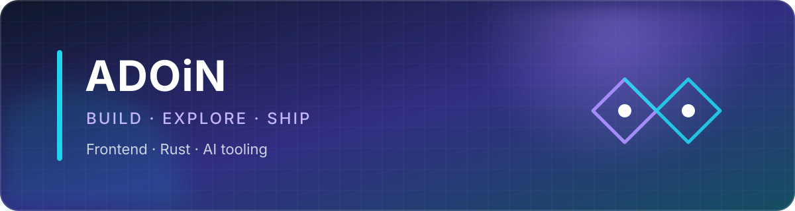
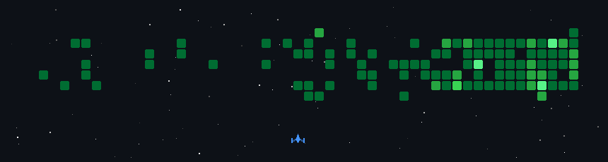

  

  
  

## 关于我

你好，我是 **胤玄 / Adoin**。喜欢把模糊的点子做成真正顺手的产品，最近主要在探索：

- 🦀 用 Rust 打造轻量、可靠的原生桌面工具
- 🟢 Vue 3、TypeScript 与前端设计系统
- 🤖 AI 辅助开发、Codex 插件和可复用工作流

> 好工具应该把复杂留给代码，把轻松留给使用者。

## 技术栈

  <picture>
    <source media="(prefers-color-scheme: dark)" srcset="https://skillicons.dev/icons?i=ts%2Cjs%2Cvue%2Cvite%2Crust%2Ctauri%2Cnodejs%2Cpython%2Chtml%2Ccss%2Cgit%2Cgithub&amp;theme=dark&amp;perline=12">
    <source media="(prefers-color-scheme: light)" srcset="https://skillicons.dev/icons?i=ts%2Cjs%2Cvue%2Cvite%2Crust%2Ctauri%2Cnodejs%2Cpython%2Chtml%2Ccss%2Cgit%2Cgithub&amp;theme=light&amp;perline=12">
    
  </picture>

## 精选项目

<table>
  <tr>
    <td width="50%" valign="top">
      <h3><a href="https://github.com/adoin/git-Agent">Git Agent</a></h3>
      
跨平台原生 Git 客户端。用 Rust + egui 构建，覆盖日常 Git 工作流、历史查看、三方合并，并提供可选的 AI 冲突分析。

      
<code>Rust</code> <code>egui</code> <code>AI</code>

    </td>
    <td width="50%" valign="top">
      <h3><a href="https://github.com/adoin/sax-design-vue">Sax Design Vue</a></h3>
      
基于 Vue 3 与 TypeScript 的 UI 组件库，延续 Vuesax 的设计语言，并提供独立文档站点。

      
<code>Vue 3</code> <code>TypeScript</code> <code>UI Library</code>

    </td>
  </tr>
</table>

  <a href="https://github.com/adoin?tab=repositories"><strong>查看全部项目 →</strong></a>

## 小憩一下

  
🚀 展开我的 GitHub 太空小游戏

   
  

    
  

  Thanks for stopping by · 愿每次提交都让想法更接近现实

